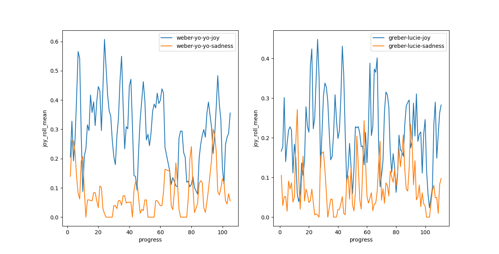
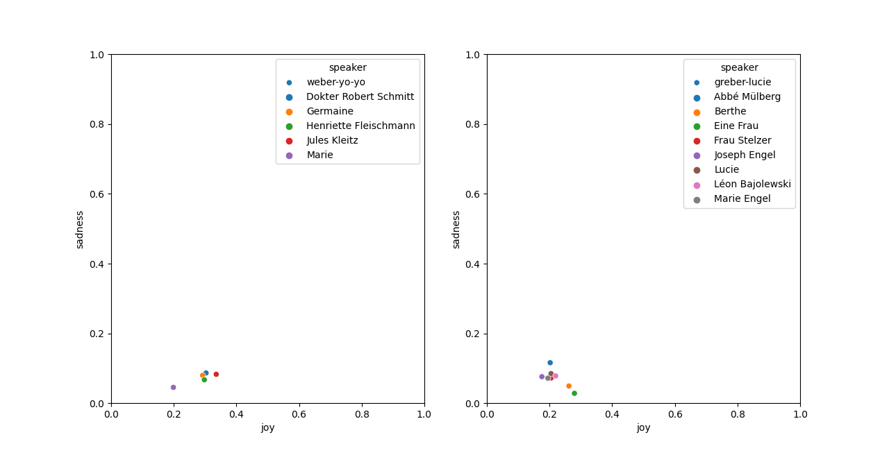
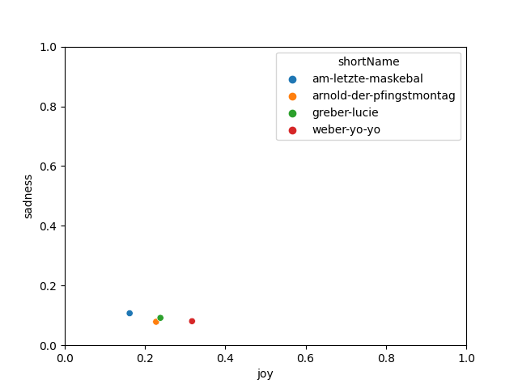
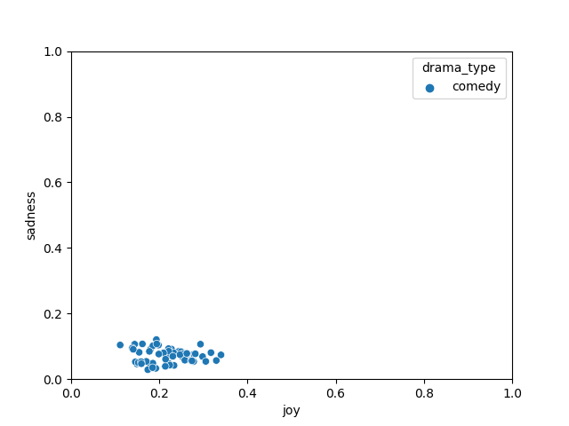
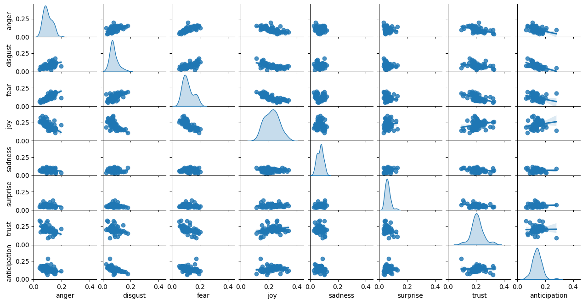
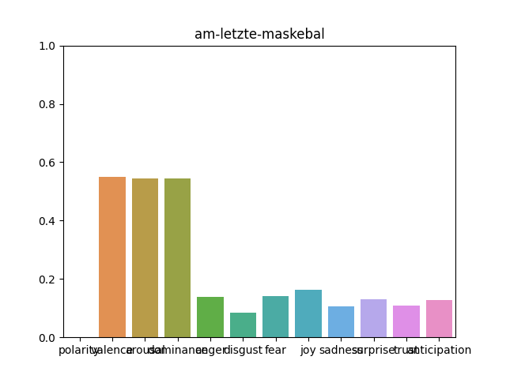
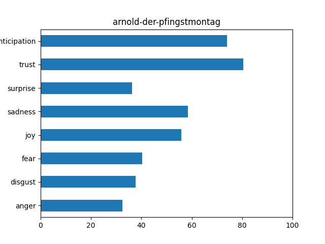
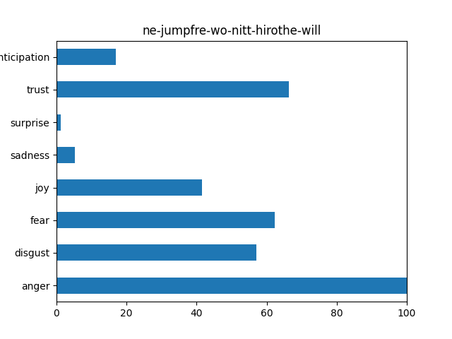

## Tutoriel

#### pre_treatment

Pour analyser les emotions dans les pièces de théâtre,  il faut d'abord extraire les informations utiles dans les fichiers XML, et les convertir en fichiers CSV. Les fichiers XML se trouvent dans *pre_treatment / tei, tei-lustig et tei2*.

Il faut ouvrir un terminal dans le répertoire racine, et faire:

```
python3 pre_treatment/script/emo_xml_treat.py nom-du-repertoire nom-du-fichier-xml
```

*Par exemple:*
```
python3 pre_treatment/script/emo_xml_treat.py tei-lustig am-letzte-maskebal.xml
```
Maintenant dans le *pre_treatment / treated_files*, il doit contient un fichier *am-letzte-maskebal.out.csv*

Après, on bouge dans le répertoire intermediate par ```cd intermediate```, on va d'abord remplacer les variants Alsacien dans les paroles par une forme normale, on peut exécuter:
```
python3 variant_als.py
``` 
Cela va remplacer les variants et créer les nouveaux fichiers CSV dans répertoire /csv_replaced, et aussi cela va calculer les idf des mots dans chaque piece par l'unité des paroles, et les sauvegarder dans répertoire /idf_info.

Pour calculer tf-idf des mots par unité des fichiers, il faut exécuter :
```
python3 idf_calculate.py
```
Cette commande peut gérer les textes bruts de chaque pièce de théâtre dans répertoire /text_brut, et aussi un fichier *idf_info.csv* qui contient tf-idf des mots dans chaque pièce de théâtre.

Les étapes finales:
D'abord aller dans le repertoire results, et ouvrir un terminal dans ce repertoire.
```cd results```
Utiliser la bibliothèque faite par https://github.com/Priya22/EmotionDynamics , la commande sera par exemple:

```
python3 avgEmoValues.py --dataPath ../pre_treatment/treated_files/am-letzte-maskebal.out.csv --lexPath ELAL-als-lexicon.csv --lexNames valence dominance arousal anger anticipation disgust fear joy sadness surprise trust --savePath am-letzte-maskebal --mode tf_idf_phrases
```
--dataPath est le chemin vers le fichier original, cela peut être ../pre_treatment/treated_files/ ou ../intermediate/csv_replaced/ (sans variants)

--lexPath est le chemin vers lexique.

--lexNames est les noms des emotions.

--savePath est le chemin (un répertoire) pour sauvegarder les résultats d'analyse.

--mode peut être "tf_idf_phrases", "tf_idf_files", "no_idf" ou justement rien.
Avec tf_idf_phrases, tf-idf des mots seront calculés par l'unité de tourne de parole.
Avec tf_idf_files, tf-idf des mots seront calculés par l'unité de fichier.
Avec no_idf ou rien, tf-idf sera pas calculé.

Avant de faire la visualisation, exécuter ces deux commandes pour préparer:
```
python3 pre-graphic.py
python3 split_plays.py
```
pregraphic.py va calculer les rolling_means des emotions pour chaque pièce de théâtre, et aussi ajouter un fichier all_pieces_info.csv qui contiennent toutes les informations de chaque pièce. Ce fichier gère les images avec --mode group.

split_plays.py va calculer et grouper les progrès des pièces de théâtre. Pour les pièce très longue, les progrès seront toujours commencent par 0 et terminent par 100.

#### Visualisation pour les émotions

Dans repetoire "results", il y a un fichier *graphic.py*, qui gère les résultats d'analyse des pièces de théâtre.

*demonstration:*

``` shell
python3 graphic.py --mode --pieces --emotions --filters --dramatype --savepath
```
**--mode**: 
Mode d'analyse. Valeurs possibles : single / group / most_positive / most_negative

*single*: 
Analyser des pièces détaillées, une visualisation micro pour faire les comparaison entre les pièces.

*group*:
Une visualisation macro pour voir les informations entre différentes emotions, types de théâtres etc.

*most_positive*:
Visualiser les emotions de la pièce la plus positive.

*most_negative*:
Visualiser les emotions de la pièce la plus negative.

**--pieces**:
Noms des pièces à analyser. Valeurs possibles:
nom(s) de(s) pièce(s) séparés par "," / all, séparés par ","
(*l'option "all" c'est que pour la --mode group*)

**--emotions**:
Noms des emotions. Valeurs possibles:
"anger" / "disgust" / "fear" / "joy" / "sadness" / "surprise" / "trust" / "anticipation"
(*Il faut toujours deux emotions séparés par "," pour la --mode group*)

**--filters**:
Noms des filtres, il faut que l'utiliser dans la --mode **single**. Valeurs possibles:
speaker / sex / job / job_category / social_class, 
séparés par ","

**--dramatype**:
Noms des types de pièces de théâtres, il faut que l'utiliser dans la --mode **group**. Valeurs possibles:
comedy / drama / horror / tale

**--savepath**:
Un chemin pour sauvegarder des images. Le chemin doit être un répertoire, le nom de fichier sera généré automatiquement selon l'analyse.


1. La progression des émotions dans une ou plusieurs pièces.

*exemple:*
```
python3 graphic.py --mode single --pieces weber-yo-yo,greber-lucie --emotions joy,sadness
```

Le progress représente le progrès de la pièce. 0 c'est le début du théâtre, 100 c'est vers la fin du théâtre.

2. Les émotions des personnages, genres, travails, classe-sociale etc.
*exemple:*

```
python3 graphic.py --mode single --pieces weber-yo-yo,greber-lucie --emotions joy,sadness --filters speaker
```

Dans cette image, on peut voir les différents niveaux de sentiments (joy et sadness) des personnages. Les coefficients de chaque point sont calculés par la valeur moyenne des emotions dans paroles de la personnage.
**Par exemple,** Dans weber-yo-yo, le point rouge (Jules Kleitz) a le plus grand valeur de joy, cela veut dire que les paroles de Jules Kleitz ont la moyenne de joy la plus élevée.

3. Analyser des émotions pour les pièces indiquées:

*exemple:*
```
python3 graphic.py --mode group --pieces weber-yo-yo,greber-lucie,am-letzte-maskebal,arnold-der-pfingstmontag --emotions joy,sadness
```


Dans le mode group, les coefficient des émotions sont calculé par le pourcentage.

le *pourcentage* implique la portion d'une emotion dans une pièce de théâtre.

D'abord, les émotions dans une pièce de théâtre ont été découpées en 2 groupes:

groupe1 : Valence, Arousal, Dominence
groupe2 : Anger, anticipation, ... trust

Le pourcentage est calculé par:
    sum de rolling-means d'une emotion / sum de rolling-means de toutes les emotions dans le groupe

**Par exemple,** le point bleu représente la portion de Joy et sadness dans am-letzte-maskebal. selon l'image, il y a presque 10% de sadness et 18% de joy dans cette pièce de théâtre. Cela sera calculée par:
rolling-mean Joy / (rolling-mean Anger + rolling-mean Anticipation + ... + rolling-mean trust)

4. Analyser des émotions pour toutes les pièces:

*exemple:*
```
python3 graphic.py --mode group --émotion joy,sadness
```


Dans cette image, on peut voir que pour comedy, les emotions sadness et joy ont une corrélation negative. 

5. Analyser des émotions pour toutes les pièces dans un même type:

*exemple:*
```
python3 graphic.py --mode group --émotion joy,sadness --dramatype comedy
```

6. Pairplot pour obtenir toutes les informations sur toutes les émotions

*exemple:*
```
python3 graphic.py --mode group --pieces all
```


7. barplot pour obtenir toutes les informations des émotions sur une seule pièce

*exemple:*
```
python3 graphic.py --mode group --pieces am-letzte-maskebal
```


**most_positive**
Trouver la pièce la plus positive et afficher les émotions dans cette pièce par barplot

*exemple:*
```
python3 graphic.py --mode most_positive
```


**most_negative**
Trouver la pièce la plus negative et afficher les émotions dans cette pièce par barplot

*exemple:*
```
python3 graphic.py --mode most_negative
```


#### Sauvegarder les images:

par exemple:

```
python3 graphic.py --mode single --pieces arnold-der-pfingstmontag,am-letzte-maskebal --emotions joy,sadness --filters sex,job_category --savepath ../graphics/savefig
```
Il faut simplement utiliser --savepath avec chemin vers le  répertoire pour sauvegarder les images. (le répertoire doit existe déjà)

