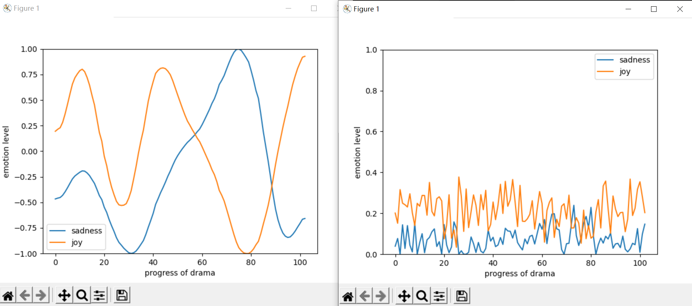

#### tasks
1. moving average (réalisé par R)
2. intégrer la partie R
3. changer graphic.py pour afficher les résultats avec moving average
4. ajouter les commentaires pour les fonctions
5. comparer les emotions contraire par moving average

```schell
# change argv[1] à mv_average pour afficher les résultats de moving average
python3 graphic.py mv_average arnold-der-pfingstmontag sadness,joy
```
**comparaison entre moving average et sans average**
*moving average: image à gauche*


sous chaque repetoire de piece de theatre, un fichier **all_emo.csv** est ajoute, 
le fichier est fait par R avec les moving averages de chaque emotions

