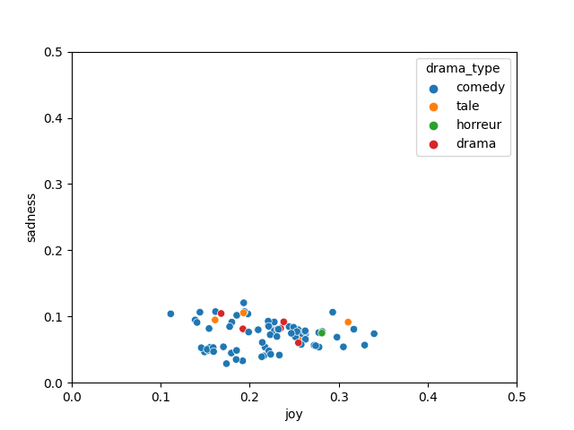

#### amelioration

1. scatterplot & rolling mean:
J'ai essayé de remplacer les moyennes d'émotions par les pourcentage.
groupe1 : Valence, Arousal, Dominence
groupe2: Anger, anticipation, ... trust

le *pourcentage* implique la portion d'une emotion dans son groupe,
calculé par:
    sum de rolling means d'une emotion / sum de rolling means de toutes les emotions dans le groupe

L'amélioration est visible, les nouveaux scatterplots ont été mis dans repetoire [graphic_scatterplot](graphic_scatterplot)

**par exemple:**
*joy et sadness avec moyennes*

*joy et sadness avec pourcantage*
