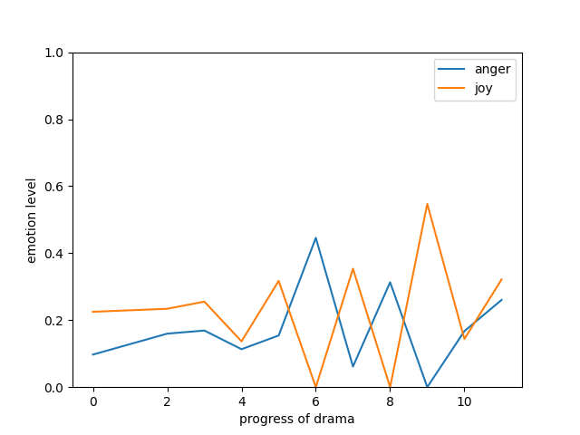
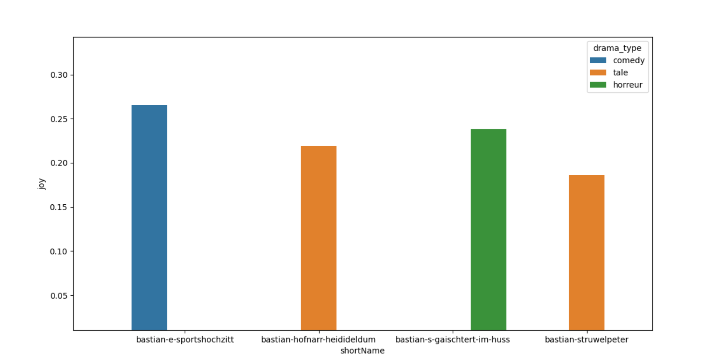

#### tasks
1. ajouter jobcategory, drama type to csv files
2. fix the bug (pas pouvoir parcourir tous le texte)
3. seaborn to plot graphs of evaluations of sentiments

#### graphic chaque piece

lineplot by seaborn

visualization pour chaque piece

```shell
python3 graphic.py single am-letzte-maskebal anger,anticipation,arousal,disgust,dominance,fear,joy,sadness,surprise,trust,valence speaker

python3 graphic.py single am-letzte-maskebal anger,joy sex,speaker

python3 graphic.py single am-letzte-maskebal anger,joy

# arg 1: nom du piece de theatre
# arg 2: les emotions (doivent etre separe par ",")
# arg 3: nom du colomn utilise pour regrouper les donnees
```
arg 1 et arg 2 sont necessaire, arg 3 optionnel

##### sample output graph:




#### graphic groupe

pour chaque emotion de chaque piece, prend une moyenne, et ecrire les resultats statistiques dans un fichier csv.

structure de donnees pour sauvegarder les valeurs:
*list*
```python
[
    [
        short_name: am-letzte-maskebal, 
        drama_type: comedy, 
        anger: 0.5, 
        anticipation: 0.5, 
        ...:...
    ]
]
```
graphic output: barplot

```shell
python3 graphic.py group --shortName zwei-erfindunge
python3 graphic.py group --emotion joy
python3 graphic.py group --emotion joy comedy
python3 graphic.py group horreur
python3 graphic.py group 
```
sample image:

